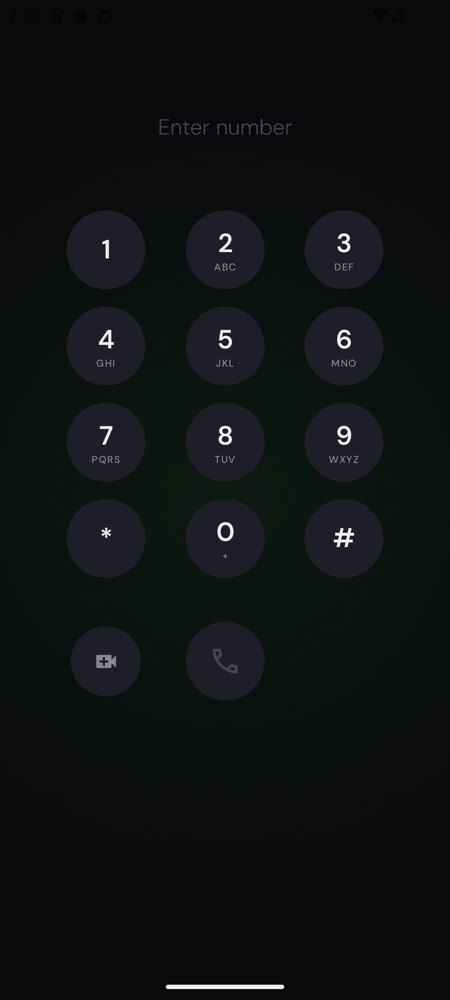
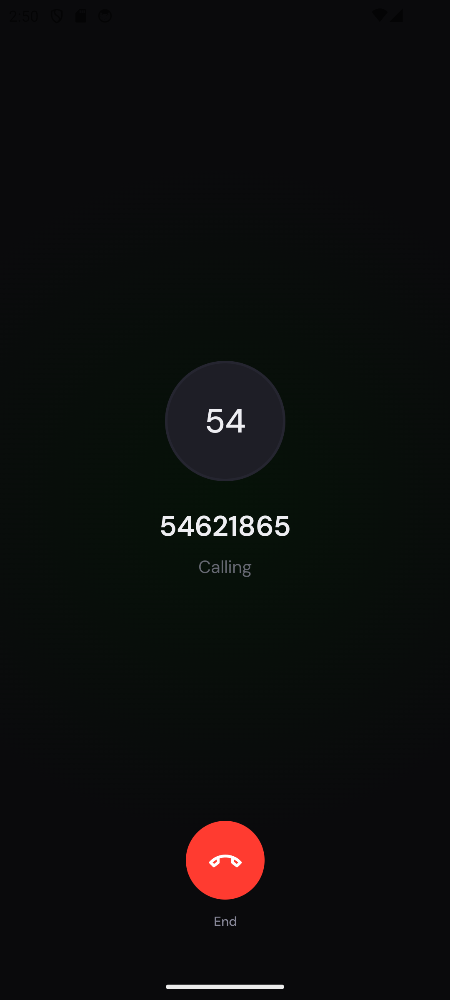
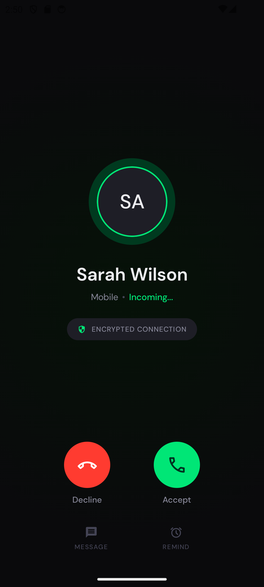
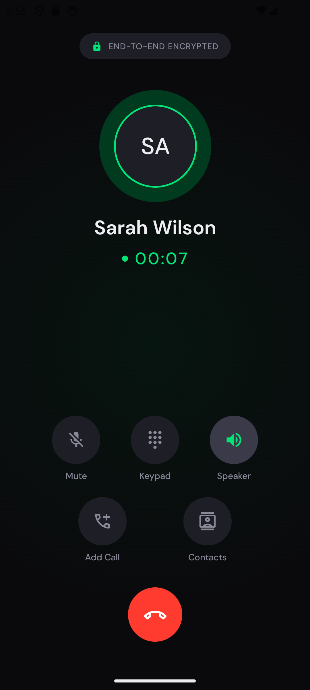

# CallApp — Calling App

A simulated calling app built with Kotlin + Jetpack Compose following MVVM architecture.

## Architecture

**Pattern:** MVVM with a unidirectional data flow via `StateFlow`.

**Key design decision:** A single shared `CallViewModel` is scoped to the nav graph and owns the `CallState` sealed class. This is the single source of truth for all call transitions. Individual screen ViewModels (`DialPadViewModel`, `ActiveCallViewModel`) only manage their own local UI state (toggles, input).

## Call State Machine
```
Idle → Calling → Ringing → Active → Ended → Idle
```

- `Idle`: Default state, dial pad visible
- `Calling`: Outgoing call screen shown, simulated incoming triggers after 3s
- `Ringing`: Incoming call screen shown
- `Active`: Call accepted, timer starts
- `Ended`: Brief ended state, auto-resets to Idle

Navigation between call screens is driven entirely by `LaunchedEffect` observing `CallState` — no screen manually navigates itself.

## Project Structure
```
app/
├── data/
│   └── repository/
│       └── CallRepositoryImpl.kt
├── di/
│   └── RepositoryModule.kt
├── domain/
│   ├── model/
│   │   ├── CallState.kt
│   │   └── Contact.kt
│   └── repository/
│       └── CallRepository.kt
├── navigation/
│   ├── NavigationState.kt
│   └── CallApp.kt
└── ui/
    ├── call/
    │   └── CallViewModel.kt          ← shared, nav-graph scoped
    ├── components/
    │   ├── CallActionButton.kt
    │   ├── CallButtons.kt
    │   ├── ContactAvatar.kt
    │   ├── DialKey.kt
    │   └── EncryptedBadge.kt
    ├── screens/
    │   ├── dialpad/
    │   │   ├── DialPadViewModel.kt
    │   │   └── DialPadScreen.kt
    │   ├── outgoing/
    │   │   └── OutgoingCallScreen.kt
    │   ├── incoming/
    │   │   └── IncomingCallScreen.kt
    │   └── activecall/
    │       ├── ActiveCallViewModel.kt
    │       └── ActiveCallScreen.kt
    └── theme/
        └── CallAppTheme.kt
```

## Fonts

Place DM Sans font files in `res/font/`:
- `dm_sans_light.ttf`
- `dm_sans_regular.ttf`
- `dm_sans_medium.ttf`
- `dm_sans_semibold.ttf`
- `dm_sans_bold.ttf`

Download from [Google Fonts — DM Sans](https://fonts.google.com/specimen/DM+Sans)

## Simulating Incoming Call

Tap the video icon (left of call button on dial pad) to trigger an immediate simulated incoming call. Alternatively, dial any number and press Call — an incoming call will be auto-simulated after 3 seconds.

## Screenshots

| Dial Pad | Outgoing Call | Incoming Call | Active Call |
|----------|---------------|---------------|-------------|
|  |  |  |  |

## Bonus Features Implemented

- Jetpack Compose ✓
- Contact name mapping via `CallRepositoryImpl.contactDirectory` ✓
- Pulse animation on avatar during ringing and active call ✓
- Smooth animated dot on "Calling..." screen ✓
- Encrypted connection badge (both incoming and active screens) ✓